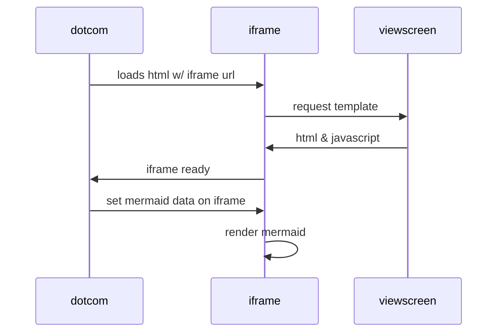

# alpha-api

API for Alpha system

# Cloning the repository

1. Create a projects folder (if you don't have one): `mkdir path_to_project_folder`
2. Go to the projects folder: `$ cd path_to_project_folder`
3. To clone a repository with git clone <url>. `$ git clone https://github.com/xandrade/alpha-api.git`

# Linux (Ubuntu-20.04) through WSL 2

1. Go to the project folder, for example: `$ cd path_to_project_folder`
2. Create virtual enviroment: `$ python3 -m venv .venv`
3. Activte enviroment: `$ source .venv/bin/activate`
4. After the virtual environment is active, we are going to want to ensure that a couple of essential Python packages within the virtual environment are up to date: `(.venv)$ pip install -U setuptools pip`
5. Install the requirements: `(.venv)$ pip install -r requirements.txt`
6. Open VSCode `(.venv)$ code .`

## WSL Port Forwarding

1. Allow Windows & Linux to reach each other. On Linux get IP address: `$ip r`
2. Run CMD as Administrator: `netsh interface portproxy add v4tov4 listenport=5000 listenaddress=0.0.0.0 connectport=5000 connectaddress=LINUX_IP_ADDRESS` and don't forget to update the ports and IP address.
2.1 Get WSL2 IP address: `ip addr show eth0 | grep 'inet\b' | awk '{print $2}' | cut -d/ -f1`

# Running the web app

1. Go to the project folder `$ cd path_to_project`
2. Activate environment `$ source .venv/bin/activate`
3. Go to app folder `$ cd ./alpha-api/app`
4. Run `$ python main.py`

## Running in product

1. Go to the project folder `$ cd path_to_project`
2. Activate environment `$ source .venv/bin/activate`
3. Go to app folder `$ cd ./alpha-api/app`
4. Run `$ hypercorn --bind '0.0.0.0:5000'  main:app -w 1 --worker-class uvloop`

curl --header "Content-Type: application/json" \
  --request POST \
  --data '{"name":"antonio","email":"test@google.com"}' \
  https://meditationbooster.org/api/friend
